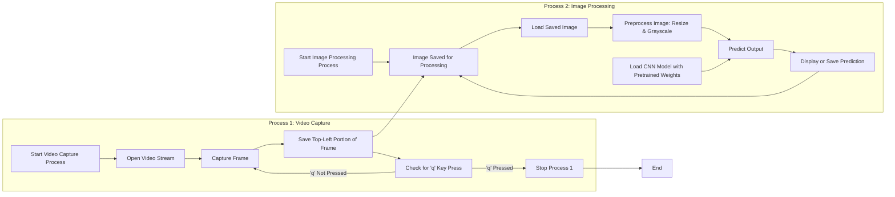

# FSx0: FingerSpelling classification

FSx0 can process samples of video captured from the webcam in real-time and output the respective english letter spelled in ASL format.

You can find the finger spelling dictionary inside letters.png

### How it works



### Setup

First install necessary libraries by running
```
pip install -r requirements.txt
```

### To run

``` 
cd FSx0
 ```

 To run FSx0, simply run the main.py!
``` 
python main.py
 ```

 To terminate the program, press ```q```.

 #### Disclaimer

 The CNN model may not function as intended due to variation in user's video feed from trained dataset